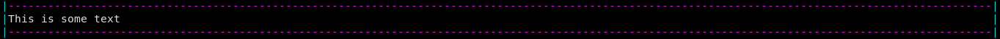

<h1 align="center">Fancy Print</h1>
<h3 align="center">An aesthetic replacement to print()</h3>

<hr>

<h6 align="center"><b>Development Status:</b> Early Development/Usable</h6>
<p align="center">
  <a href="https://pypi.org/project/fancyprint/">
	
  </a>
</p>

# About

FancyPrint is a python package, making it easier for developers to get beautiful CLI with responsiveness in regards to terminal size.

# Usage

## Installing FancyPrint

To install fancyprint use the following command:
```bash
pip install fancyprint
```
This will install all dependencies needed as well.

## Getting Started

To start using Fancy Print, first import it.
```python
import fancyprint
```
This will import all the necessary functions required.

### Basics

#### Printing

The ``pretty_print()`` function is for printing text to the terminal. Here is an example:
```python
pretty_print("This is some text", align=Align.LEFT)
```

It is using the default preset, which can be changed by using presets or changing argument values.
There are two ways one customize and use it, and they can be
used interchangeably:
- Using presets (recommended)
- Using keyword arguments

##### Using Presets
Presets allow you to customize the printer and the separator, and they can be *local* presets or *global* presets.
Presets are local when they are created for one part only(i.e Printer) and are global when they can be used anywhere
(both in the Separator and the Printer). 

###### Using Local Presets
There are two types of local presets you can use:
- PrinterPreset
- SeparatorPreset

**PrinterPreset**
<br>
<br>
The ``PrinterPreset`` is used to customize the ``pretty_print()`` function. To use it, you need to import it first.
Here is an example of declaring a ``PrinterPreset``:
```python
from fancyprint.ftypes import PrinterPreset
from fancyprint.ftypes import Color

my_custom_printer_preset = PrinterPreset(
    delimiter_left="<",
    delimiter_left_color=Color.RED,
    
    delimiter_right=">",
    delimiter_right_color=Color.RED,
    
    delimiter_space_amount=10,
    delimiter_space_symbol=" ",
    
    hyphenation=False
)
```
Here's the preset in action:
```python
[...]
pretty_print("Hi this is some text", preset=my_custom_printer_preset)
```
This will print the following:

That looks awful right now. That is because we have a custom printer preset, but the separator is using
the default preset. Let's make it more good-looking by using a custom separator preset!

**SeparatorPreset**
<br>
<br>
The ``SeperatorPreset`` is used to customize the separator, whether it is used alone or with the printer. To use it, it
needs to be imported first. Here is an example of declaring one:
```python
from fancyprint.ftypes import SeparatorPreset, Color

my_custom_separator_preset = SeparatorPreset(
    delimiter_left="<",
    delimiter_left_color=Color.RED,
    
    delimiter_right=">",
    delimiter_right_color=Color.RED,
    
    delimiter_space_symbol=" ",
    delimiter_space_amount=10,
    
    separator_symbol="-",
    separator_color=Color.BLUE,
)
```
Now let's use this preset, in the previous example:
```python
[...]
pretty_print("Hi, this is some text!", preset=my_custom_printer_preset, separator_preset=my_custom_separator_preset)
```
The above will print the following:

It's starting to look good now, but since we are going to use one preset everywhere, *in this example*,
we should create a global preset.

###### Using the Global Preset
The ``Preset`` class is used to create a global preset, and can be given to both the separator and the printer, which
makes it useful if the whole program is to follow a simple theme. To use it you need to import the ``Preset``, along
with the local presets, which make it easy to declare a global Preset. Here's an example of declaring a global preset,
using our previously declared local presets:
```python
[...]
from fancyprint.ftypes import Preset

global_preset = Preset(
    printer_preset=my_custom_printer_preset,
    separator_preset=my_custom_separator_preset,
)
```
The previous example, but with a global preset would like:
```python
[...]
pretty_print("Hi, this is some text!", preset=global_preset, separator_preset=global_preset)
```
This will print:


#### Using Keyword Arguments
If you want to have different customizations, you could use presets, but if you only want to change some aspects of the
printer, you might want to use the function's keyword arguments instead. Here's a list of available customizations you 
can do with arguments:
- align | Align(Enum): Changes the alignment of the text
- delimiter_left | str: Symbol for the left delimiter
- delimiter_left_color | Color: Color for the left delimiter
- enable_left_delimiter | bool: Whether to print the left delimiter or not
- delimiter_right | str: Symbol for the right delimiter
- delimiter_right_color | Color: Color to be used for the right delimiter
- enable_right_delimiter | bool: Whether to print the right delimiter
- delimiter_space_amount | int: Amount of space to print after/before the delimiters
- delimiter_space_symbol | str: Symbol to be used for the delimiter space (" " is the default and is useful for most cases)
- separator_left_delimiter | str: Symbol for the left delimiter of the separators
- separator_left_delimiter_color | Color: Color for the left delimiters of the separators
- enable_left_separator_delimiter | bool: Whether to print the left delimiter in the separators
- separator_right_delimiter | str: Symbol for the right delimiter of the separators
- separator_right_delimiter_color | Color: Color for the right separator delimiters
- enable_right_separator_delimiter | bool: Whether to print the right delimiter in the separators
- separator_symbol | str: Symbol for the separator
- separator_color | Color: Color for the separator symbol
- enable_separator_symbol | bool: Whether to print the separator symbol, if false then " " will be printed
- separator_delimiter_space_amount | int: Amount of delimiter space in the separator
- separator_delimiter_space_symbol | str: Symbol for the delimiter space in the separator
- enable_back_separator | bool: Whether to print the back separator
- enable_front_separator | bool: Whether to print the front separator
- test_mode | bool: If you want to mess with the alignment calculations
- testing_terminal_width | int: Artificial terminal width to use, for testing or for making something beautiful ;)

##### Alignment
There are three alignment options available at the moment. They are left, right and center. To use alignments, you need 
to import the Align enum from the ftypes subpackage. Here are examples of using the different alignments:
```python
[...]
from fancyprint.ftypes import Align

pretty_print("Hi, this is some text!", align=Align.LEFT)
pretty_print("Hi, this is some text!", align=Align.CENTER)
pretty_print("Hi, this is some text!", align=Align.RIGHT)
```
The above gives the following results:

Doesn't look too nice, let's remove some separators:
```python
[...]

pretty_print("Hi, this is some text!", align=Align.LEFT)
pretty_print("Hi, this is some text!", align=Align.CENTER, enable_back_separator=False)
pretty_print("Hi, this is some text!", align=Align.RIGHT, enable_back_separator=False)
```

Much better. You might also want some "padding", which is called "delimiter space" in the function. Let's add some
delimiter space to the print statements!
```python
[...]

pretty_print("Hi, this is some text!", align=Align.LEFT, delimiter_space_amount=10)
pretty_print("Hi, this is some text!", align=Align.CENTER, enable_back_separator=False, delimiter_space_amount=10)
pretty_print("Hi, this is some text!", align=Align.RIGHT, enable_back_separator=False, delimiter_space_amount=10)
```

Everything looks good to this point. But you might want to see where the spaces are. You might do something like this:
```python
[...]
pretty_print("Hi, this is some text!", align=Align.LEFT, delimiter_space_amount=10, delimiter_space_symbol="=")
pretty_print("Hi, this is some text!", align=Align.CENTER, enable_back_separator=False, delimiter_space_amount=10, delimiter_space_symbol="=")
pretty_print("Hi, this is some text!", align=Align.RIGHT, enable_back_separator=False, delimiter_space_amount=10, delimiter_space_symbol="=")
```

#### Separation
Other than being used in the print function, you can also use the ``separater_line()`` function to print a separator line.
As in like in printing, you can also use the separator with both a preset or keyword arguments. We already covered the
separator preset in [Using Local Presets](#using-local-presets), so it will not be in this section. 
The following keyword arguments are available for customizations:
- preset | Preset, SeparatorPreset: If you want to use a preset
- delimiter_left | str: Symbol for the left delimiter
- delimiter_left_color | Color: Color for the left delimiter
- enable_left_delimiter | bool: Whether to print the left delimiter
- delimiter_right | str: Symbol for the right delimiter
- delimiter_right_color | Color: Color for the right delimiter
- enable_delimiter_right | bool: Whether to print the right delimiter
- delimiter_space_amount | int: Amount of delimiter space to print
- delimiter_space_symbol | str: Symbol for the delimiter space
- separator_symbol | str: Symbol for the seperator
- separator_color | Color: Color for the separator
- enable_separator | bool: Whether to print the separator symbol, else " " will be used
- test_mode | bool: Whether to use test mode
- testing_terminal_width | int: Artificial terminal width for testing or for making separator more customized ;)

Here's an example of using the separate_line() function:
```python
from fancyprint.printer import separate_line

separate_line(delimiter_left="(", separator_symbol="*")
```
This will print:

It looks pretty bad, but remember making a preset is recommended for most cases.

# Contributing
Thanks for considering contributing to Fancy Print. You can read Contributing.md for further information!

<hr>
Remember to keep your apps fancy ;)